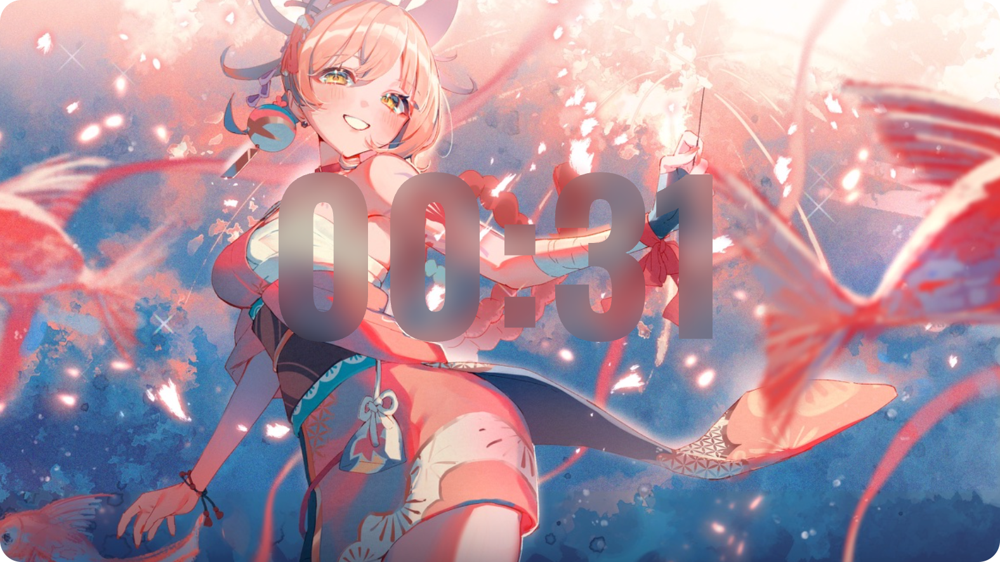

# Glass Text Web Component (毛玻璃文字组件)

一个轻量、无依赖的 Web Component，用于在图片上创建优雅的毛玻璃文字效果。



在线演示：[blur-text.seeridia.top](https://blur-text.seeridia.top)

## 🚀 如何使用

1.  在你的项目中引入 `glass-text.js` 文件。

    ```html
    <script src="path/to/glass-text.js" defer></script>
    ```

2.  在你的HTML中使用 `<glass-text>` 标签，并提供图片源。

    ```html
    <glass-text image-src="path/to/your-image.jpeg">
      你的文字
    </glass-text>

    <glass-text
      image-src="path/to/another-image.png"
      blur="8"
      brightness="1.2"
      font-size="80px"
      font-family="'微软雅黑', sans-serif"
    >
      更多文字
    </glass-text>
    ```

## 🛠️ API / 属性

通过设置HTML属性来控制组件的各种参数。

| 属性            | 描述                                                                          | 默认值         |
| --------------- | ----------------------------------------------------------------------------- | -------------- |
| `image-src`     | **(必需)** 背景图片的URL。                                                      | `''`           |
| `blur`          | 毛玻璃效果的模糊半径。可提供纯数字，组件会自动添加 `px` 单位。                    | `'10'`         |
| `brightness`    | 毛玻璃效果的亮度。`1` 为原始亮度，大于1变亮，小于1变暗。                        | `'0.8'`        |
| `object-fit`    | 图片的填充模式 (`cover` 或 `contain`)。当容器和图片比例不一致时生效（例如对组件额外设置了`max-height`时）。 | `'cover'`      |
| `text-x`        | 文字在X轴上的位置 (百分比)。                                                    | `'50%'`        |
| `text-y`        | 文字在Y轴上的位置 (百分比)。                                                    | `'50%'`        |
| `font-size`     | 文字大小，需要带单位 (如 `100px`, `12vw`)。                                     | `'100px'`      |
| `font-weight`   | 文字字重 (如 `400`, `bold`)。                                                   | `'700'`        |
| `font-family`   | 文字字体。                                                                      | `'sans-serif'` |

## 🎨 样式化

你可以像给普通`<div>`一样，用CSS选择器 `glass-text` 来设置组件的样式，例如宽度、边框、阴影等。

**重要提示：** 你通常只需要设置 `width` 或 `max-width`，组件会自动计算并撑开正确的高度。

```css
glass-text {
  width: 90%;
  max-width: 800px;
  border-radius: 12px;
  box-shadow: 0 10px 30px rgba(0, 0, 0, 0.5);
  margin: 20px auto;
}
```

### 高级样式 (CSS Parts)

组件内部的图片元素暴露了 `part` 属性，允许通过 `::part()` 伪元素进行更深层的样式定制。

- `part="image"`: 同时选中背景图和毛玻璃效果图。
- `part="clipped-image"`: 只选中应用了毛玻璃效果的图。

```css
/* 例如：给组件内的图片添加一个内阴影 */
glass-text::part(image) {
  box-shadow: inset 0 0 10px rgba(0, 0, 0, 0.5);
}
```
